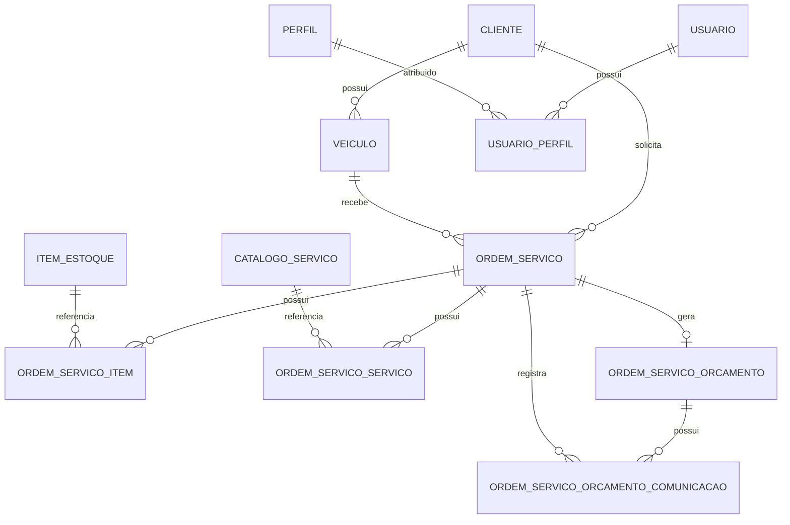

# Modelo Relacional e Dicionário de Dados

Este documento descreve as tabelas identificadas nos models ORM do projeto de Ordem de Serviço, seus campos, tipos, chaves e relacionamentos.

> **Observação sobre tipos:** quando o tipo SQL foi definido explicitamente com SQLAlchemy, ele é reproduzido abaixo. Quando o model utiliza apenas anotação Python/`Field`, o tipo é indicado como inferido pelo SQLModel. A representação de datas usa `DateTime(timezone=True)` porque é assim que os models estão definidos; o nome exato do tipo físico pode variar conforme o SGBD.

---

## 1. Visão geral das tabelas

| Tabela | Model | Finalidade |
|---|---|---|
| `cliente` | `ClienteModel` | Cadastro de clientes |
| `veiculo` | `VeiculoModel` | Veículos pertencentes aos clientes |
| `ordem_servico` | `OrdemServicoModel` | Registro principal das ordens de serviço |
| `item_estoque` | `ItemEstoqueModel` | Cadastro e controle de itens de estoque |
| `catalogo_servico` | `ServicoModel` | Catálogo de serviços oferecidos |
| `ordem_servico_item` | `OrdemServicoItemModel` | Itens de estoque vinculados a uma OS |
| `ordem_servico_servico` | `OrdemServicoServicoModel` | Serviços vinculados a uma OS |
| `ordem_servico_orcamento` | `OrdemServicoOrcamentoModel` | Orçamento associado à OS |
| `ordem_servico_orcamento_comunicacao` | `OrdemServicoOrcamentoComunicacaoModel` | Histórico de comunicação do orçamento |
| `usuario` | `UsuarioModel` | Usuários do sistema |
| `perfil` | `PerfilModel` | Perfis de acesso |
| `usuario_perfil` | `UsuarioPerfilModel` | Associação entre usuários e perfis |

---

# 2. Dicionário de dados

## 2.1. Tabela `cliente`

| Campo | Tipo | Chave / Restrição | Nulo | Padrão | Descrição |
|---|---|---|---|---|---|
| `id` | `UUID` | PK | Não | — | Identificador do cliente |
| `tipo_pessoa` | `CHAR(2)` | — | Não | — | Tipo de pessoa |
| `nome_razao_social` | `VARCHAR(150)` | — | Não | — | Nome ou razão social |
| `cpf_cnpj` | `VARCHAR(14)` | UNIQUE | Não | — | CPF ou CNPJ |
| `telefone` | `VARCHAR(20)` | — | Não | — | Telefone |
| `email` | `VARCHAR(150)` | — | Sim | `NULL` | E-mail |
| `cep` | `VARCHAR(8)` | — | Sim | `NULL` | CEP |
| `logradouro` | `VARCHAR(150)` | — | Sim | `NULL` | Logradouro |
| `numero` | `VARCHAR(20)` | — | Sim | `NULL` | Número do endereço |
| `complemento` | `VARCHAR(100)` | — | Sim | `NULL` | Complemento |
| `bairro` | `VARCHAR(100)` | — | Sim | `NULL` | Bairro |
| `cidade` | `VARCHAR(100)` | — | Sim | `NULL` | Cidade |
| `uf` | `CHAR(2)` | — | Sim | `NULL` | UF |
| `ativo` | `BOOLEAN` | — | Não | `TRUE` | Indica se o cliente está ativo |
| `criado_em` | `DateTime(timezone=True)` | — | Não | — | Data de criação |
| `atualizado_em` | `DateTime(timezone=True)` | — | Não | — | Data da última atualização |

---

## 2.2. Tabela `veiculo`

| Campo | Tipo | Chave / Restrição | Nulo | Padrão | Descrição |
|---|---|---|---|---|---|
| `id` | `UUID` | PK | Não | — | Identificador do veículo |
| `cliente_id` | `UUID` | FK → `cliente.id` | Não | — | Cliente proprietário |
| `placa` | `VARCHAR(10)` | UNIQUE | Não | — | Placa do veículo |
| `marca` | `VARCHAR(60)` | — | Não | — | Marca |
| `modelo` | `VARCHAR(60)` | — | Não | — | Modelo |
| `ano_fabricacao` | `SMALLINT` | — | Sim | `NULL` | Ano de fabricação |
| `ano_modelo` | `SMALLINT` | — | Sim | `NULL` | Ano do modelo |
| `cor` | `VARCHAR(30)` | — | Sim | `NULL` | Cor |
| `criado_em` | `DateTime(timezone=True)` | — | Não | — | Data de criação |
| `atualizado_em` | `DateTime(timezone=True)` | — | Não | — | Data da última atualização |

---

## 2.3. Tabela `ordem_servico`

| Campo | Tipo | Chave / Restrição | Nulo | Padrão | Descrição |
|---|---|---|---|---|---|
| `id` | `UUID` | PK | Não | — | Identificador da ordem de serviço |
| `cliente_id` | `UUID` | FK → `cliente.id` | Não | — | Cliente da OS |
| `veiculo_id` | `UUID` | FK → `veiculo.id` | Não | — | Veículo da OS |
| `status` | `VARCHAR(30)` | — | Não | — | Status atual da OS |
| `queixa_inicial` | `TEXT` | — | Não | — | Queixa inicial informada |
| `diagnostico` | `TEXT` | — | Sim | `NULL` | Diagnóstico |
| `criado_em` | `DateTime(timezone=True)` | — | Não | — | Data de criação |
| `atualizado_em` | `DateTime(timezone=True)` | — | Não | — | Data da última atualização |
| `iniciado_diagnostico_em` | `DateTime(timezone=True)` | — | Sim | `NULL` | Início do diagnóstico |
| `diagnostico_concluido_em` | `DateTime(timezone=True)` | — | Sim | `NULL` | Conclusão do diagnóstico |
| `pagamento_registrado_em` | `DateTime(timezone=True)` | — | Sim | `NULL` | Data de registro do pagamento |
| `forma_pagamento` | `VARCHAR(30)` | — | Sim | `NULL` | Forma de pagamento |
| `valor_pago` | `NUMERIC(12,2)` | — | Sim | `NULL` | Valor pago |
| `pagamento_observacao` | `TEXT` | — | Sim | `NULL` | Observação do pagamento |

---

## 2.4. Tabela `item_estoque`

| Campo | Tipo | Chave / Restrição | Nulo | Padrão | Descrição |
|---|---|---|---|---|---|
| `id` | `UUID` | PK | Não | — | Identificador do item |
| `tipo` | `VARCHAR(10)` | — | Não | — | Tipo do item |
| `nome` | `VARCHAR(100)` | — | Não | — | Nome |
| `descricao` | `VARCHAR(255)` | — | Sim | `NULL` | Descrição |
| `codigo` | `VARCHAR(50)` | UNIQUE | Sim | `NULL` | Código do item |
| `quantidade_disponivel` | `INTEGER` | — | Não | `0` | Quantidade disponível |
| `quantidade_reservada` | `INTEGER` | — | Não | `0` | Quantidade reservada |
| `quantidade_minima` | `INTEGER` | — | Não | `0` | Quantidade mínima |
| `valor_unitario` | `NUMERIC(10,2)` | — | Não | — | Valor unitário |
| `ativo` | `BOOLEAN` | — | Não | `TRUE` | Indica se o item está ativo |
| `criado_em` | `DateTime(timezone=True)` | — | Não | — | Data de criação |
| `atualizado_em` | `DateTime(timezone=True)` | — | Não | — | Data da última atualização |

---

## 2.5. Tabela `catalogo_servico`

| Campo | Tipo | Chave / Restrição | Nulo | Padrão | Descrição |
|---|---|---|---|---|---|
| `id` | `UUID` | PK | Não | — | Identificador do serviço |
| `nome` | `VARCHAR(100)` | UNIQUE | Não | — | Nome do serviço |
| `descricao` | `VARCHAR(255)` | — | Sim | `NULL` | Descrição |
| `valor_base` | `NUMERIC(10,2)` | — | Não | — | Valor base |
| `tempo_medio_minutos` | `INTEGER` | — | Não | — | Tempo médio estimado |
| `ativo` | `BOOLEAN` | — | Não | `TRUE` | Indica se o serviço está ativo |
| `criado_em` | `DateTime(timezone=True)` | — | Não | — | Data de criação |
| `atualizado_em` | `DateTime(timezone=True)` | — | Não | — | Data da última atualização |

---

## 2.6. Tabela `ordem_servico_item`

Entidade associativa entre ordem de serviço e item de estoque.

| Campo | Tipo | Chave / Restrição | Nulo | Padrão | Descrição |
|---|---|---|---|---|---|
| `id` | `UUID` | PK | Não | — | Identificador do vínculo |
| `ordem_servico_id` | `UUID` | FK → `ordem_servico.id` | Não | — | Ordem de serviço |
| `item_estoque_id` | `UUID` | FK → `item_estoque.id` | Não | — | Item de estoque |
| `nome_item` | `VARCHAR(100)` | — | Não | — | Nome do item registrado na OS |
| `tipo_item` | `VARCHAR(10)` | — | Não | — | Tipo do item registrado na OS |
| `quantidade` | `INTEGER` | — | Não | — | Quantidade utilizada/reservada |
| `valor_unitario` | `NUMERIC(10,2)` | — | Não | — | Valor unitário registrado na OS |
| `status` | `VARCHAR(20)` | — | Não | — | Status do item dentro da OS |

### Chaves estrangeiras

- `ordem_servico_item.ordem_servico_id` → `ordem_servico.id`
- `ordem_servico_item.item_estoque_id` → `item_estoque.id`

---

## 2.7. Tabela `ordem_servico_servico`

Entidade associativa entre ordem de serviço e catálogo de serviços.

| Campo | Tipo | Chave / Restrição | Nulo | Padrão | Descrição |
|---|---|---|---|---|---|
| `id` | `UUID` | PK | Não | — | Identificador do vínculo |
| `ordem_servico_id` | `UUID` | FK → `ordem_servico.id` | Não | — | Ordem de serviço |
| `servico_id` | `UUID` | FK → `catalogo_servico.id` | Não | — | Serviço do catálogo |
| `nome_servico` | `VARCHAR(100)` | — | Não | — | Nome registrado na OS |
| `descricao_servico` | `VARCHAR(255)` | — | Sim | `NULL` | Descrição registrada na OS |
| `valor_unitario` | `NUMERIC(10,2)` | — | Não | — | Valor praticado na OS |
| `tempo_estimado_minutos` | `INTEGER` | — | Não | — | Tempo estimado |
| `tempo_executado_minutos` | `INTEGER` | — | Sim | `NULL` | Tempo efetivamente executado |
| `observacao` | `TEXT` | — | Sim | `NULL` | Observações |
| `cancelado` | `BOOLEAN` | — | Não | `FALSE` | Indica cancelamento |

### Chaves estrangeiras

- `ordem_servico_servico.ordem_servico_id` → `ordem_servico.id`
- `ordem_servico_servico.servico_id` → `catalogo_servico.id`

---

## 2.8. Tabela `ordem_servico_orcamento`

| Campo | Tipo | Chave / Restrição | Nulo | Padrão | Descrição |
|---|---|---|---|---|---|
| `id` | `UUID` | PK | Não | — | Identificador do orçamento |
| `ordem_servico_id` | `UUID` | FK → `ordem_servico.id`, UNIQUE | Não | — | Ordem de serviço |
| `status` | `VARCHAR(20)` | — | Não | — | Status do orçamento |
| `total_servicos` | `NUMERIC(12,2)` | — | Não | — | Total dos serviços |
| `total_itens` | `NUMERIC(12,2)` | — | Não | — | Total dos itens |
| `total_geral` | `NUMERIC(12,2)` | — | Não | — | Total geral |
| `criado_em` | `DateTime(timezone=True)` | — | Não | — | Data de criação |
| `atualizado_em` | `DateTime(timezone=True)` | — | Não | — | Data de atualização |
| `comunicado_em` | `DateTime(timezone=True)` | — | Sim | `NULL` | Data em que foi comunicado |
| `observacao` | `TEXT` | — | Sim | `NULL` | Observações |
| `respondido_em` | `DateTime(timezone=True)` | — | Sim | `NULL` | Data da resposta |
| `motivo_recusa` | `TEXT` | — | Sim | `NULL` | Motivo de eventual recusa |

### Regra de cardinalidade

A coluna `ordem_servico_id` possui `UNIQUE`, portanto uma mesma OS não pode possuir dois registros nessa tabela.

Isso caracteriza:

`ordem_servico 1 : 0..1 ordem_servico_orcamento`

---

## 2.9. Tabela `ordem_servico_orcamento_comunicacao`

| Campo | Tipo | Chave / Restrição | Nulo | Padrão | Descrição |
|---|---|---|---|---|---|
| `id` | `UUID` | PK | Não | — | Identificador da comunicação |
| `orcamento_id` | `UUID` | FK → `ordem_servico_orcamento.id` | Não | — | Orçamento relacionado |
| `ordem_servico_id` | `UUID` | FK → `ordem_servico.id` | Não | — | Ordem de serviço relacionada |
| `canal` | `VARCHAR(20)` | — | Não | — | Canal de comunicação |
| `destino` | `VARCHAR(255)` | — | Não | — | Destinatário/endereço |
| `sucesso` | `BOOLEAN` | — | Não | — | Resultado do envio |
| `mensagem` | `TEXT` | — | Não | — | Mensagem enviada |
| `provedor` | `VARCHAR(50)` | — | Não | — | Provedor utilizado |
| `referencia_externa` | `VARCHAR(255)` | — | Sim | `NULL` | Identificador externo |
| `enviado_em` | `DateTime(timezone=True)` | — | Não | — | Data/hora do envio |
| `criado_em` | `DateTime(timezone=True)` | — | Não | — | Data de criação do registro |

### Chaves estrangeiras

- `ordem_servico_orcamento_comunicacao.orcamento_id` → `ordem_servico_orcamento.id`
- `ordem_servico_orcamento_comunicacao.ordem_servico_id` → `ordem_servico.id`

---

## 2.10. Tabela `usuario`

| Campo | Tipo | Chave / Restrição | Nulo | Padrão | Descrição |
|---|---|---|---|---|---|
| `id` | `UUID` | PK | Não | — | Identificador do usuário |
| `nome` | `VARCHAR`* | — | Não | — | Nome |
| `email` | `VARCHAR`* | UNIQUE | Não | — | E-mail |
| `senha_hash` | `VARCHAR`* | — | Não | — | Hash da senha |
| `criado_em` | `DateTime(timezone=True)` | — | Não | — | Data de criação |
| `atualizado_em` | `DateTime(timezone=True)` | — | Não | — | Data de atualização |
| `ativo` | `BOOLEAN`* | — | Não | `TRUE` | Indica se o usuário está ativo |

\* Tipo inferido pelo SQLModel a partir da anotação Python; o model não declara `sa.Column(...)` nem comprimento SQL explícito nesses campos.

---

## 2.11. Tabela `perfil`

| Campo | Tipo | Chave / Restrição | Nulo | Padrão | Descrição |
|---|---|---|---|---|---|
| `id` | `UUID` | PK | Não | — | Identificador do perfil |
| `nome` | `VARCHAR(30)`* | UNIQUE | Não | — | Nome do perfil |
| `descricao` | `VARCHAR(150)`* | — | Não | — | Descrição |
| `criado_em` | `DateTime(timezone=True)` | — | Não | — | Data de criação |
| `atualizado_em` | `DateTime(timezone=True)` | — | Não | — | Data de atualização |
| `ativo` | `BOOLEAN`* | — | Não | `TRUE` | Indica se o perfil está ativo |

\* Tipo inferido pelo SQLModel. Os comprimentos `30` e `150` são definidos no próprio `Field`.

---

## 2.12. Tabela `usuario_perfil`

Entidade associativa entre usuários e perfis.

| Campo | Tipo | Chave / Restrição | Nulo | Padrão | Descrição |
|---|---|---|---|---|---|
| `id` | `UUID` | PK | Não | — | Identificador do vínculo |
| `usuario_id` | `UUID` | FK → `usuario.id` | Não | — | Usuário |
| `perfil_id` | `UUID` | FK → `perfil.id` | Não | — | Perfil |
| `criado_em` | `DateTime(timezone=True)` | — | Não | — | Data de criação do vínculo |

### Restrição de unicidade

Existe a seguinte restrição composta:

`UNIQUE(usuario_id, perfil_id)`

Ela impede que um mesmo perfil seja atribuído mais de uma vez ao mesmo usuário.

---

# 3. Resumo das chaves estrangeiras

| Tabela filha | Campo FK | Tabela referenciada | Campo |
|---|---|---|---|
| `veiculo` | `cliente_id` | `cliente` | `id` |
| `ordem_servico` | `cliente_id` | `cliente` | `id` |
| `ordem_servico` | `veiculo_id` | `veiculo` | `id` |
| `ordem_servico_item` | `ordem_servico_id` | `ordem_servico` | `id` |
| `ordem_servico_item` | `item_estoque_id` | `item_estoque` | `id` |
| `ordem_servico_servico` | `ordem_servico_id` | `ordem_servico` | `id` |
| `ordem_servico_servico` | `servico_id` | `catalogo_servico` | `id` |
| `ordem_servico_orcamento` | `ordem_servico_id` | `ordem_servico` | `id` |
| `ordem_servico_orcamento_comunicacao` | `orcamento_id` | `ordem_servico_orcamento` | `id` |
| `ordem_servico_orcamento_comunicacao` | `ordem_servico_id` | `ordem_servico` | `id` |
| `usuario_perfil` | `usuario_id` | `usuario` | `id` |
| `usuario_perfil` | `perfil_id` | `perfil` | `id` |

---

# 4. Cardinalidades

## 4.1. Tabela consolidada

| Entidade A | Cardinalidade | Entidade B | Implementação | Observação |
|---|---|---|---|---|
| `cliente` | 1 : 0..N | `veiculo` | `veiculo.cliente_id` | Cada veículo pertence a um cliente |
| `cliente` | 1 : 0..N | `ordem_servico` | `ordem_servico.cliente_id` | Cada OS pertence a um cliente |
| `veiculo` | 1 : 0..N | `ordem_servico` | `ordem_servico.veiculo_id` | Um veículo pode possuir várias OS ao longo do tempo |
| `ordem_servico` | 1 : 0..N | `ordem_servico_item` | `ordem_servico_item.ordem_servico_id` | Uma OS pode possuir vários itens |
| `item_estoque` | 1 : 0..N | `ordem_servico_item` | `ordem_servico_item.item_estoque_id` | Um item pode aparecer em várias OS |
| `ordem_servico` | N : N | `item_estoque` | Via `ordem_servico_item` | Relação conceitual N:N |
| `ordem_servico` | 1 : 0..N | `ordem_servico_servico` | `ordem_servico_servico.ordem_servico_id` | Uma OS pode possuir vários serviços |
| `catalogo_servico` | 1 : 0..N | `ordem_servico_servico` | `ordem_servico_servico.servico_id` | Um serviço pode aparecer em várias OS |
| `ordem_servico` | N : N | `catalogo_servico` | Via `ordem_servico_servico` | Relação conceitual N:N |
| `ordem_servico` | 1 : 0..1 | `ordem_servico_orcamento` | FK + `UNIQUE(ordem_servico_id)` | No máximo um orçamento por OS |
| `ordem_servico_orcamento` | 1 : 0..N | `ordem_servico_orcamento_comunicacao` | `orcamento_id` | Um orçamento pode possuir várias comunicações |
| `ordem_servico` | 1 : 0..N | `ordem_servico_orcamento_comunicacao` | `ordem_servico_id` | A comunicação também referencia a OS diretamente |
| `usuario` | 1 : 0..N | `usuario_perfil` | `usuario_perfil.usuario_id` | Um usuário pode receber vários perfis |
| `perfil` | 1 : 0..N | `usuario_perfil` | `usuario_perfil.perfil_id` | Um perfil pode estar em vários usuários |
| `usuario` | N : N | `perfil` | Via `usuario_perfil` | Associação N:N |

---

# 5. Diagrama ER

O diagrama abaixo utiliza sintaxe Mermaid e pode ser renderizado diretamente pelo GitHub e por ferramentas compatíveis.



---

# 6. Relacionamentos N:N transformados em entidades associativas

O modelo possui três relações que merecem destaque.

## 6.1. Ordem de serviço × item de estoque

Relação conceitual:

`ordem_servico N : N item_estoque`

Implementada através de:

`ordem_servico_item`

A tabela associativa também possui atributos próprios do relacionamento, como:

- `quantidade`;
- `valor_unitario`;
- `status`;
- `nome_item`;
- `tipo_item`.

Por isso, ela deve ser tratada como uma entidade do modelo e não apenas como uma tabela de ligação simples.

## 6.2. Ordem de serviço × serviço

Relação conceitual:

`ordem_servico N : N catalogo_servico`

Implementada através de:

`ordem_servico_servico`

A entidade associativa registra propriedades específicas da execução daquele serviço na OS, como:

- valor unitário;
- tempo estimado;
- tempo executado;
- observação;
- cancelamento.

## 6.3. Usuário × perfil

Relação conceitual:

`usuario N : N perfil`

Implementada através de:

`usuario_perfil`

A restrição:

`UNIQUE(usuario_id, perfil_id)`

garante que o mesmo perfil não seja associado duas vezes ao mesmo usuário.

---

# 7. Restrições de unicidade identificadas

| Tabela | Campo(s) | Restrição |
|---|---|---|
| `cliente` | `cpf_cnpj` | UNIQUE |
| `veiculo` | `placa` | UNIQUE |
| `item_estoque` | `codigo` | UNIQUE |
| `catalogo_servico` | `nome` | UNIQUE |
| `usuario` | `email` | UNIQUE |
| `perfil` | `nome` | UNIQUE |
| `usuario_perfil` | `usuario_id`, `perfil_id` | UNIQUE composta |
| `ordem_servico_orcamento` | `ordem_servico_id` | UNIQUE |

---

# 8. Observações sobre o modelo

## 8.1. Cliente, veículo e ordem de serviço

A tabela `ordem_servico` armazena simultaneamente `cliente_id` e `veiculo_id`.

Como `veiculo` também possui `cliente_id`, há dois caminhos possíveis para determinar o cliente relacionado à OS:

```text
ordem_servico -> cliente
```

e

```text
ordem_servico -> veiculo -> cliente
```

O modelo deve garantir na regra de negócio que o veículo informado na OS pertença ao mesmo cliente registrado diretamente na ordem.

## 8.2. Comunicação do orçamento

A tabela `ordem_servico_orcamento_comunicacao` possui tanto `orcamento_id` quanto `ordem_servico_id`.

Como o próprio orçamento já referencia uma ordem de serviço, também existem dois caminhos:

```text
comunicacao -> ordem_servico
```

e

```text
comunicacao -> orcamento -> ordem_servico
```

Caso os dois campos sejam mantidos, a aplicação deve garantir que ambos representem a mesma ordem de serviço.

## 8.3. Histórico de valores

As tabelas `ordem_servico_item` e `ordem_servico_servico` armazenam dados como nome e valor unitário mesmo possuindo referência para o cadastro original.

Essa estrutura permite preservar informações históricas da ordem de serviço. Assim, alterações posteriores no preço ou na descrição do item/serviço não precisam alterar o conteúdo já registrado em uma OS anterior.

---

# 9. Legenda

| Símbolo / Tipo | Significado |
|---|---|
| PK | Primary Key / Chave primária |
| FK | Foreign Key / Chave estrangeira |
| UNIQUE | Valor ou combinação de valores não pode se repetir |
| `1 : N` | Relacionamento um para muitos |
| `N : N` | Relacionamento muitos para muitos |
| `0..1` | Zero ou um registro |
| `0..N` | Zero, um ou vários registros |
| `UUID` | Identificador universal |
| `VARCHAR(n)` | Texto de tamanho variável com limite |
| `CHAR(n)` | Texto de tamanho fixo |
| `TEXT` | Texto sem tamanho curto predefinido no model |
| `INTEGER` | Número inteiro |
| `SMALLINT` | Número inteiro de menor faixa |
| `NUMERIC(p,s)` | Número decimal com precisão e escala definidas |
| `BOOLEAN` | Valor verdadeiro/falso |
| `DateTime(timezone=True)` | Data e hora com suporte a informação de fuso horário |

---

## Fonte

Documento elaborado a partir dos models ORM presentes no projeto e fornecidos para análise.
